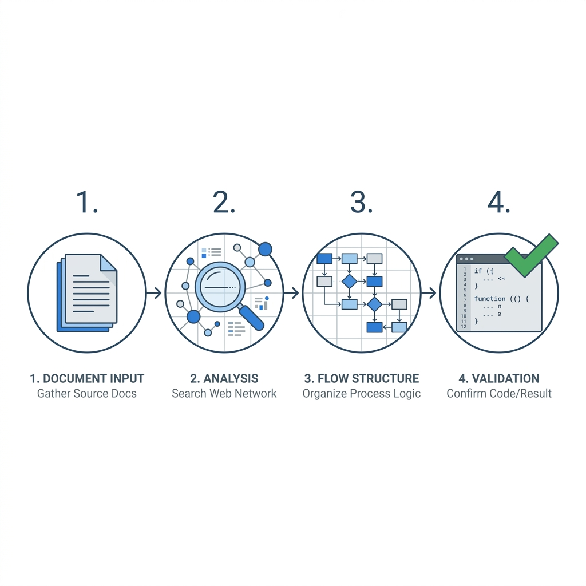

# LLM-IFY 🚀

Automating the translation of Deep Learning research papers into production-ready Hugging Face PyTorch repositories.



## 🤔 What is LLM-IFY?

LLM-IFY is a multi-agent framework built with **LangGraph** that tackles the structural and semantic gaps between academic PDFs and functional code. Inspired by the **NERFIFY** paper ([arXiv:2603.00805v1](https://arxiv.org/abs/2603.00805v1)), it reliably generates state-of-the-art model implementations that pass structural shape checks right out of the box.

Implementing complex AI models from research papers often involves days of untangling dense mathematical notation, tracking down implicit dependencies, and ensuring strict compliance with frameworks like Hugging Face `transformers`. LLM-IFY automates this painstaking process through formal grammar constraints and closed-loop testing.

## 🧠 Architecture Pipeline

LLM-IFY orchestrates a powerful four-stage pipeline:

1. **📄 Paper Summarizer**: Parses standard academic PDFs (via `PyMuPDF`), extracting exact mathematical formulations, pseudo-algorithms, and architectural novelties without losing structural integrity.
2. **🕸️ Citation Crawler**: Detects implicit math dependencies (e.g., "We use the memory-efficient attention from [14]") and iteratively resolves them using web search or a localized Knowledge Base, utilizing a two-stage heuristic to optimize queries.
3. **💻 Graph-of-Thought (GoT) Coder**: Generates complex multi-file repositories in topological order. It strictly obeys a Context-Free Grammar (CFG) enforcing that classes inherit `PreTrainedModel` or `PretrainedConfig`, and that `forward()` signatures follow the Hugging Face spec. Prompts are centralized to ensure maximum instruction adherence.
4. **🕵️ Critique & Self-Healing**: Automatically executes an import and runtime smoke-test on the generated model (e.g., running dummy training steps). It feeds any OOM, shape mismatch, or syntax stack traces back to the coder for continuous refinement up to 5 loop iterations until convergence.

## 🛠️ Installation

LLM-IFY requires Python 3.9+ and relies heavily on LangGraph and the Gemini API.

```bash
# Clone the repository
git clone https://github.com/your-username/llm-ify.git
cd llm-ify

# Install the required dependencies
pip install -r requirements.txt
```

### Environment Variables

The pipeline is powered by Gemini Models (like Gemini 1.5 Pro). You must create a `.env` file or export your API key into your session:

```bash
export GOOGLE_API_KEY="your_api_key_here"
```

## 🚀 Usage

You can kick off the entire end-to-end framework using the integrated CLI `main.py`:

```bash
python main.py synthesize --pdf /path/to/research_paper.pdf --name my_custom_model
```

### Execution Flow
1. **Initialize**: Spins up the LangGraph application.
2. **Parse**: Reads and segments the provided research paper PDF.
3. **Configure**: Enforces strict Hugging Face codebase rules (from `.agent/rules/hf_cfg.md`).
4. **Stream**: Emits real-time agent states, allowing you to watch the repository DAG construction, continuous coding, and smoke test negotiations.
5. **Output**: Once the critique agent gives the green light, the generated Hugging Face-compliant files are placed in the `output/<name>/` directory.

You can also run the legacy pipeline (if you prefer hard-coded paths) via:
```bash
python run_pipeline.py
```

## 📜 License
This project is licensed under the terms of the LICENSE file included in the repository.
